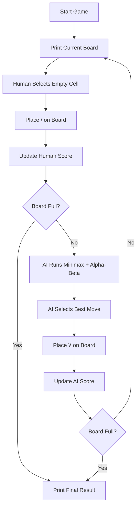
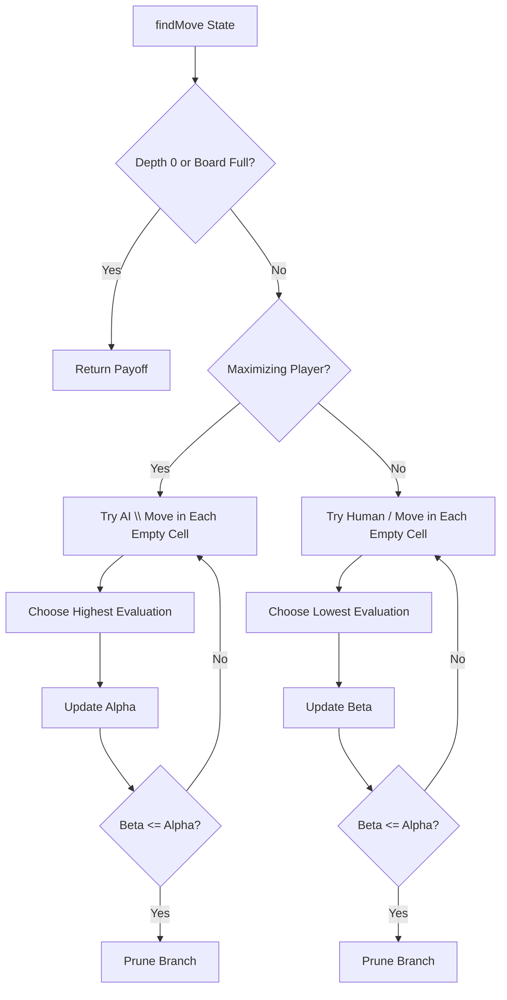

# 🎮 AI Slant Game Tree Search


## 📌 Overview

This project implements a command-line version of the **Slant** two-player zero-sum game using **game tree search**. The human player competes against a computer-controlled AI that evaluates future board states with **minimax search** and improves search efficiency with **alpha-beta pruning**.

The game is played on an `m x m` grid. Each empty cell can be filled with a diagonal line. The human player uses `/`, while the AI uses `\`. Some board intersections contain scoring numbers, and players receive points when the number of diagonal lines touching an intersection matches that intersection's required value.

---

## 🧠 Core AI Concepts Used

- **Game Tree Search** to represent possible future moves
- **Minimax** to model the human as the minimizing player and the AI as the maximizing player
- **Alpha-Beta Pruning** to avoid evaluating branches that cannot improve the final decision
- **Zero-Sum Payoff Function** where one player's gain is the other player's loss
- **State Expansion** by generating successor boards for every available empty cell

---

## 🎲 Game Rules

- The board is represented as an `m x m` grid.
- The human player places `/` diagonals.
- The AI player places `\` diagonals.
- Each player fills one empty cell per turn.
- Some intersections contain scoring values.
- If the number of diagonals touching an intersection equals that intersection's value, the current player receives that many points.
- Once an intersection gives points, it cannot give points again.
- The opponent loses the same number of points, making the game zero-sum.
- The game ends when all cells are filled.
- The player with the higher final score wins.

---

## 🕹️ Player Roles

| Player | Symbol | Search Role | Goal |
|---|---:|---|---|
| Human | `/` | MIN | Reduce the AI's payoff |
| AI | `\` | MAX | Maximize its payoff |

The AI is modeled as the **maximizing player**, and the human is modeled as the **minimizing player**.

---

## 🧩 Game Tree Model

### State Representation

Each state stores:

- Current board grid
- Intersection objects and their scoring status
- Last played cell position
- Parent state reference
- Player that produced the state
- Number of empty cells left
- Points received after the most recent move

### Initial State

The initial state contains:

- An empty `m x m` board
- A predefined `(m + 1) x (m + 1)` intersection layout
- No scored intersections
- No selected move yet

### Terminal State

A terminal state is reached when every cell has been filled:

```python
currentState.emptyCellCount == 0
```

### State Transition

A successor state is created by:

1. Selecting one empty cell.
2. Placing the current player's diagonal symbol.
3. Recalculating whether any intersections now satisfy their scoring condition.
4. Marking newly scored intersections so they cannot be scored again.

### Payoff Function

The payoff is calculated from the AI player's perspective:

```python
payoff = maxPlayerPoints - minPlayerPoints
```

A higher payoff is better for the AI, while a lower payoff is better for the human player.

---

## 🔎 AI Search Strategy

The AI uses the `findMove()` function to evaluate possible moves.

```python
findMove(currentState, alpha, beta, maximizingPlayer, depth)
```

### Search Behavior

- If it is the AI's turn, the search places `\` in each possible empty cell and chooses the move with the highest evaluation.
- If it is the human's simulated turn, the search places `/` in each possible empty cell and chooses the move with the lowest evaluation.
- Alpha stores the best value found so far for the maximizing player.
- Beta stores the best value found so far for the minimizing player.
- Branches are pruned when `beta <= alpha`.

The current implementation uses a search depth of `6`, which is enough to fully evaluate the provided `2 x 2` board configuration.

---

## 🏗️ Project Structure

```text
./
├── main.py                         # Main Python implementation of the game and AI search
├── GAME-RUNS.txt                   # Two sample command-line game traces
```

---

## ⚙️ How to Run

This project only uses Python's built-in libraries, so no extra package installation is required.

### 1. Download the Project

Download the project files and open the project folder on your computer.

Make sure `main.py` is inside the folder you are opening.

### 2. Run the Program

Open a terminal or command prompt inside the project folder and run:

```bash
python main.py
```

If your system uses `python3` instead of `python`, run:

```bash
python3 main.py
```

### 3. Play the Game

The board prints selectable cell numbers for empty cells. Type the number of the cell where you want to place `/`.

Example starting board:

```text
1  --- -1  --- 1
|   1   |   2   |
-1  --- 2  --- -1
|   3   |   4   |
-1  --- -1  --- 1
```

If you type `4`, the human player's `/` will be placed in cell 4.

---

## 🧪 Sample Run Summary

The included `GAME-RUNS.txt` file contains two different runs of the game.

### Run 1

- Human first selects cell `4`.
- AI responds by selecting cell `2`.
- Human then selects cell `1`.
- AI selects cell `3`.
- Final result: draw.

### Run 2

- Human first selects cell `2`.
- Human immediately receives points from one intersection.
- AI responds with a stronger scoring move.
- Final result: AI wins.

---

## 🔁 Game Flow Diagram



---

## 🧠 Minimax Flow



---

## 🧱 Important Implementation Details

### `intersect` Class

Stores data for each intersection:

- Required diagonal count
- Whether the intersection has already awarded points
- Which player received the points

### `State` Class

Stores a full game snapshot and immediately calculates newly received points after a move.

### `calculatePoints()`

Checks the four neighboring cells around each intersection:

- Down-left
- Down-right
- Up-left
- Up-right

If the number of touching diagonals matches the intersection's scoring value, the current player receives points.

### `calculatePayOff()`

Evaluates a state from the AI's perspective:

```python
AI points - human points
```

### `findMove()`

Performs minimax search with alpha-beta pruning and returns the selected move for the AI.

---

## 🛠️ Configuration

The board is currently configured inside `main.py`:

```python
m = 2

currentIntersects = [
    [1, -1, 1],
    [-1, 2, -1],
    [-1, -1, 1]
]
```

To experiment with a different board, update:

- `m` for the playable board size
- `currentIntersects` for the intersection scoring layout

For an `m x m` playable board, the intersection matrix must be `(m + 1) x (m + 1)`.

---

## ✅ Features

- Interactive command-line gameplay
- Human vs AI game loop
- Board printing with selectable cell numbers
- Automatic score calculation
- Prevents the same intersection from scoring multiple times
- Minimax-based AI decision-making
- Alpha-beta pruning optimization
- Sample game traces included

---

## 🚀 Possible Improvements

- Add input validation for already-filled cells and invalid cell numbers
- Move board setup into a separate configuration file
- Support larger board sizes from user input
- Add difficulty levels by changing minimax search depth
- Remove artificial AI delay for faster automated testing
---
